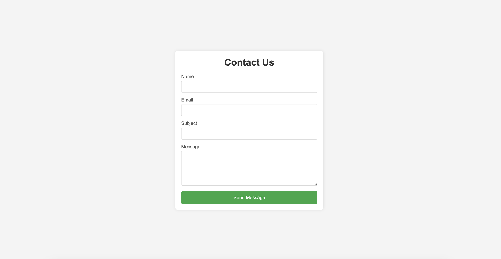
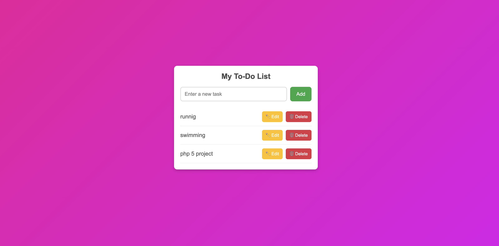
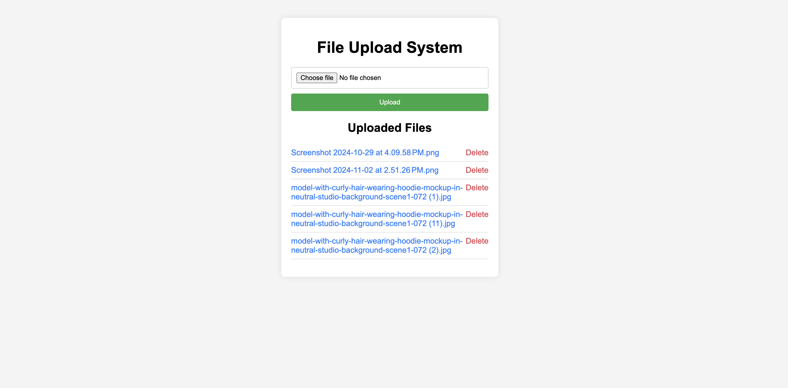

# Contact Form

A simple contact form application built with HTML, CSS, PHP, and JavaScript. It allows users to send messages that are processed and sent to a specified email address.

## Features
- User-friendly form with validation
- Real-time input validation using JavaScript
- Server-side validation using PHP
- Sends email with the form data

## Screenshots


## Installation
1. Clone the repository:
   ```bash
   git clone https://github.com/username/contact-form.git
   ```
2. Navigate to the project directory:
   ```bash
   cd contact-form
   ```
3. Start MAMP (or any local server) and place the project in the server's root directory (`htdocs`).
4. Open `index.html` in your browser.

## Technologies Used
- HTML, CSS, JavaScript
- PHP
- MAMP (Local Server)


# To-Do List

A simple and interactive To-Do List application to help you manage your daily tasks. It was built using HTML, CSS, and JavaScript, with data persistence through local storage.

## Features
- Add, edit, and delete tasks
- Mark tasks as complete
- Data is saved in the browser's local storage
- Responsive design for mobile and desktop

## Screenshots


## Installation
1. Clone the repository:
   ```bash
   git clone https://github.com/username/to-do-list.git
   ```
2. Navigate to the project directory:s
   ```bash
   cd to-do-list
   ```
3. Open `index.html` in your browser.

## Technologies Used
- HTML, CSS, JavaScript
- Local Storage for data persistence


# File System

A basic web-based file system application built with PHP. It allows users to upload, view, and manage files within a specified directory on the server.

## Features
- Upload files to the server
- View a list of uploaded files
- Delete files from the server
- Basic security checks for file uploads

## Screenshots


## Installation
1. Clone the repository:
   ```bash
   git clone https://github.com/username/file-system.git
   ```
2. Navigate to the project directory:
   ```bash
   cd file-system
   ```
3. Start MAMP (or any local server) and place the project in the server's root directory (`htdocs`).
4. Open `index.php` in your browser.

## Technologies Used
- HTML, CSS
- PHP
- MAMP (Local Server)

# Login Page with Email OTP Verification

A PHP-based login system with email verification using OTP (One-Time Password). It includes secure user registration and OTP email verification using PHPMailer.

---

## Features
- User registration with email
- OTP generation and email verification
- Secure password storage with hashing
- Real-time feedback for OTP verification
- MySQL database integration

---

## Technologies Used
- PHP
- MySQL
- PHPMailer
- HTML, CSS
- JavaScript

---

## Setup and Installation

### Step 1: Clone the Repository
Clone the repository to your local machine:
```bash
git clone https://github.com/username/login-page-otp-verification.git
```

### Step 2: Set Up the MySQL Database
1. Create a database named `login_app`.
2. Import the following SQL schema:
```sql
CREATE TABLE users (
    id INT AUTO_INCREMENT PRIMARY KEY,
    email VARCHAR(255) UNIQUE,
    password VARCHAR(255),
    otp VARCHAR(6),
    is_verified TINYINT DEFAULT 0,
    created_at TIMESTAMP DEFAULT CURRENT_TIMESTAMP
);
```

### Step 3: Install PHPMailer
Install PHPMailer using Composer:
```bash
composer require phpmailer/phpmailer
```

### Step 4: Configure Email Settings
Update the email configuration in `register.php`:
```php
$mail->Username = 'your-email@gmail.com';
$mail->Password = 'your-app-password';
```

### Step 5: Update Database Connection Details
Modify the database connection details in `register.php` and `verify.php` to match your local MySQL credentials.

### Step 6: Start the Application
Start your local server (e.g., MAMP, WAMP, or XAMPP) and access the application in your browser:
```
http://localhost/login-page-otp-verification/index.php
```

---

## Usage
1. **Register**: Create an account using email and password.
2. **Receive OTP**: An OTP is sent to your registered email.
3. **Verify OTP**: Enter the OTP to complete your registration.
4. **Login**: Access your account after successful email verification.

---

## Troubleshooting
- **Email Not Sending**: Check your SMTP settings or ensure you are using an App Password for your email account.
- **Database Connection Issues**: Verify the database credentials in your connection files (`register.php` and `verify.php`).

---

## License
This project is open-source under the [MIT License](LICENSE).

---

## Contact
For any inquiries, please reach out to:  
**[your-email@example.com]**
